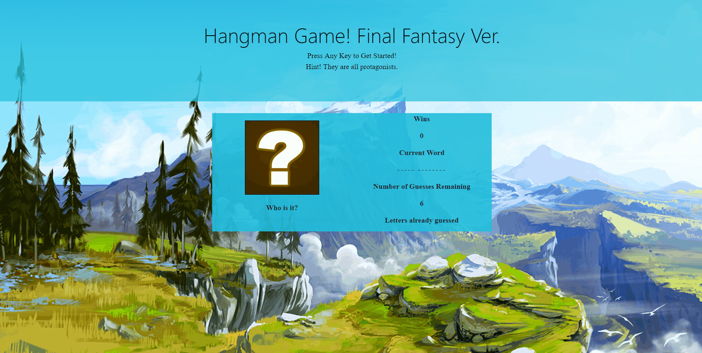

# Word-Guess-Game Final Fantasy Version!

Guess the word I'm thinking of! A hangman game with the theme of Final Fantasy Protagonists


## Demo
<br>
[Click here to start playing](https://tintdang.github.io/Word-Guess-Game/)

### Getting Started
```shell
git clone git@github.com:tintdang/Word-Guess-Game.git
open index.html in your favorite browser
```

### How to play
- The user is allowed 6 guesses to guess the name of the character
- The user is allowed to press any alphabetical character to guess
- The pick is relayed onto a list that will be shown at the bottom of the content box.
- The user wins if they fill in the entire name of the character

### Features
- A specific song will play when the user wins or lose
- The user is alerted when they press a letter that they already picked and it does not count towards remaining guesses
- An image shows at the end of which character they guessed correctly


## Built With
- HTML
- CSS
- [Bootstrap](https://getbootstrap.com/)
- Vanilla Javascript

## Author

* **Tin Dang**  - [tintdang](https://github.com/tintdang)

## Acknowledgments

* Thanks to The Coding Boot Camp at UT Austin